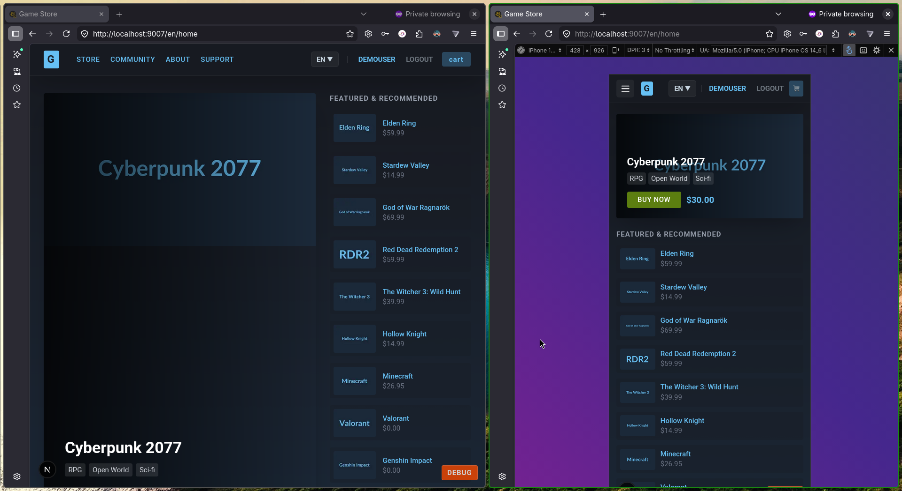
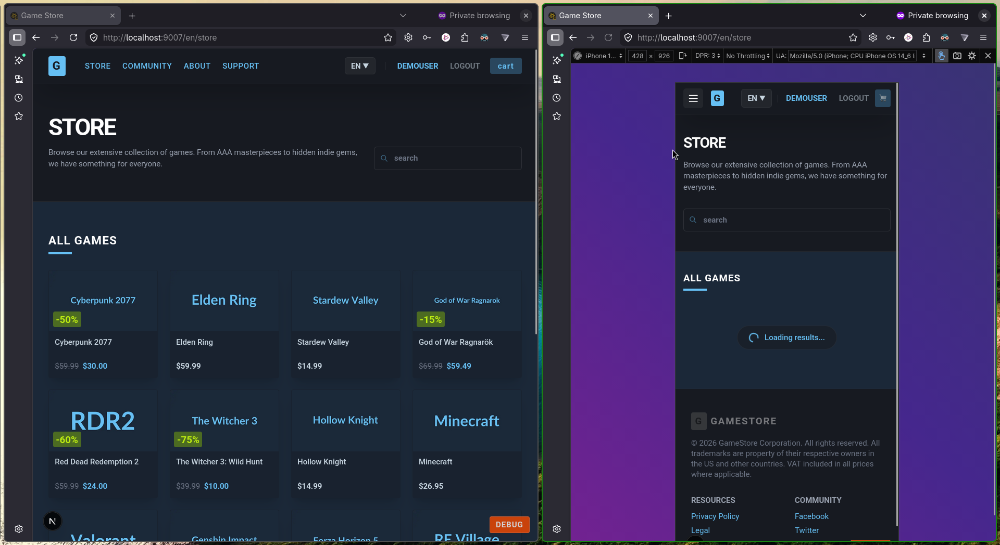
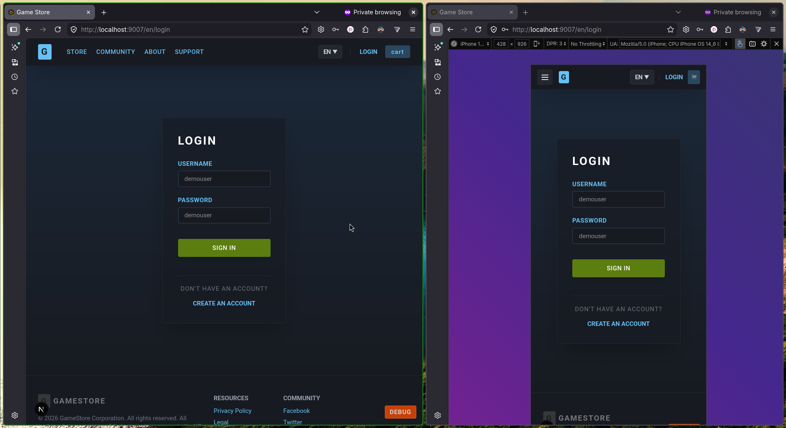
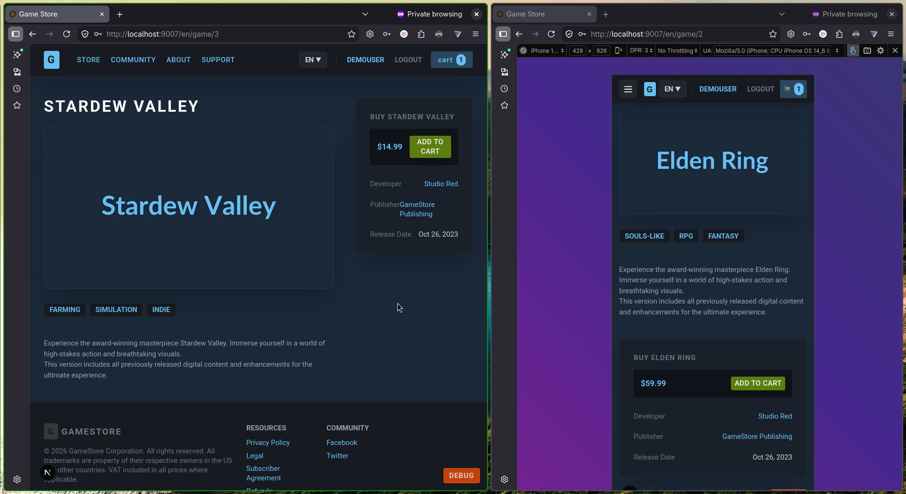
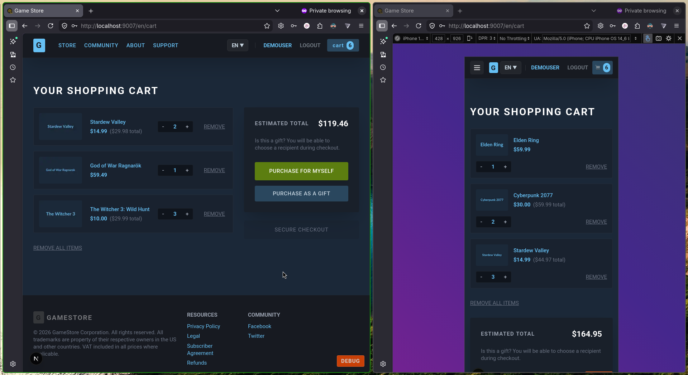

# GameStore Frontend

A modern, high-performance Game Store frontend built with Next.js 16 (App Router), mimicking the iconic Steam Store aesthetic and functionality.

<br>

## Key Features

- **Steam-Inspired UI:** High-fidelity dark theme with responsive layouts for desktop and mobile.
- **Internationalization (I18n):** Full support for English (en) and Bahasa Indonesia (id) using language-prefixed routing (`/{lang}/`).
- **Infinite Store Catalog:** 100+ unique procedurally generated game entries with localized metadata.
- **Smart Search:** Debounced, client-side search filtering across titles and tags.
- **Lazy Loading:** Performance-optimized infinite scroll implementation on the store page using `IntersectionObserver`.
- **Hybrid Rendering:** Mix of async server components for core pages and 'use client' for interactive islands and the infinite-scroll store.
- **Secure Session:** Auth managed via HTTP-only-style cookie, read server-side on every request.
- **Server-Side Cart:** Cart persisted in a signed cookie, hydrated server-side on layout load, updated via server actions with optimistic client-side feedback.
- **Optimistic UI:** Cart mutations apply instantly on the client and call server actions in the background.
- **Client-Side Form Validation:** Login and register forms validate fields before the server action fires, with inline error messages.
- **Image Optimization:** Utilizes `next/image` with remote patterns for high-performance localized asset delivery.
- **Mock Integration:** Ready-to-use mock API layer for account management, product catalogs, and checkout flows.
- **Environment Management:** Multi-environment support (debug, staging, prod) via unified environment variables.

<br>

## Technical Stack

- **Framework:** [Next.js 16](https://nextjs.org/) (App Router, Turbopack)
- **Library:** [React 19](https://react.dev/)
- **Styling:** [Tailwind CSS 4](https://tailwindcss.com/)
- **Testing:** [Vitest](https://vitest.dev/) + [Playwright](https://playwright.dev/)
- **State Management:** React Context + Server Actions + Optimistic UI
- **Runtime:** [Bun](https://bun.sh/) (Recommended) or Node.js

<br>

## Documentation

Detailed technical documentation is available in the `docs/` directory:

<br>

### Core Architecture
- **[Project Overview](docs/PROJECT.md):** High-level goals, core mandates, and project structure.
- **[High-Level Design (HLD)](docs/HLD.md):** System architecture, routing flows, and service integration.
- **[Low-Level Design (LLD)](docs/LLD.md):** Path definitions, component mapping, and API logic.
- **[Hybrid Architecture](docs/HYBRID-ARCHITECTURE.md):** Detailed breakdown of the server-first hybrid strategy (SSR + streaming + client islands).

<br>

### Feature Specifications
- **[Authentication](docs/AUTH.md):** User registration, login lifecycle, and profile management.
- **[Internationalization](docs/I18N.md):** Implementation details for multi-language support.
- **[Store & Checkout](docs/STORE.md):** Game browsing, server-side cart, and purchase flows.

<br>

### Exceptions & Compatibility
- **[Exceptions](docs/EXCEPTIONS.md):** Known third-party extension conflicts and workarounds.
- **[Importants](docs/IMPORTANTS.md):** Critical development notes and troubleshooting history.

<br>

### Quality Assurance
- **[Unit Testing (Vitest)](docs/TEST-VITE.md):** Strategy for testing hooks, state, and translations.
- **[E2E Testing (Playwright)](docs/TEST-PLAYWRIGHT.md):** Cross-browser automation for core user flows (Chrome, Firefox, Safari).

<br>

### CI/CD
- **[Format on Merge](.github/workflows/format-on-merge.yml):** Auto-formats code with ESLint on every merge to `main`.

<br>

### Decisions & History
- **[Architecture Decision Records (ADR)](docs/ADR/ADR-20260411_180000.md):** Documented architectural choices and their rationales.

<br>

## Getting Started

### Prerequisites
- [Bun](https://bun.sh/) or Node.js (v18+)

### Installation
1. Clone the repository.
2. Install dependencies:
   ```bash
   bun install
   ```
3. Copy the environment template and configure:
   ```bash
   cp .env.template .env
   ```

### Running Debug Server
```bash
bun dev
```
Open [http://localhost:9007](http://localhost:9007) to see the result.

### Running Tests
Detailed instructions available in the [Vitest](docs/TEST-VITE.md) and [Playwright](docs/TEST-PLAYWRIGHT.md) documentation.

```bash
bun run test              # Run unit tests (Vitest)
bun run test:e2e          # Run all E2E tests (cross-browser)
bun run test:e2e --project=chromium   # Chromium only
bun run test:e2e --project=firefox    # Firefox only
```

<br>

## Project Structure
```text
├── app/                  # Next.js App Router (localized pages)
│   └── [lang]/
│       ├── layout.tsx    # Server layout — reads session + cart from cookies
│       ├── store/        # Store page with Suspense streaming
│       ├── game/[id]/    # Game detail — AddToCartButton (client island)
│       ├── login/        # Server page + LoginForm (client validation)
│       ├── register/     # Server page + RegisterForm (client validation)
│       ├── cart/         # Cart page (client — reads CartProvider)
│       ├── checkout/     # Checkout page (client)
│       └── profile/      # Server page — server-side auth guard
├── components/           # Shared UI components (Navbar, GameCard, etc.)
├── docs/                 # Technical documentation & ADRs
├── lib/
│   ├── api/
│   │   ├── account.ts    # Auth server actions (login, logout, getSession)
│   │   ├── cart.ts       # Cart server actions (getCart, addToCartAction, …)
│   │   ├── auth-context.tsx  # AuthProvider (client)
│   │   └── dummy-data.ts # Mock game catalog
│   ├── hooks/
│   │   └── useCart.tsx   # CartProvider — optimistic state + server actions
│   └── i18n/             # Localization (translations, context, server util)
├── public/               # Static assets
└── tests/
    ├── cart.test.tsx     # useCart hook unit tests
    ├── i18n.test.ts      # Translation key parity tests
    ├── setup.ts          # jsdom mocks (next/navigation, next/headers)
    └── e2e/
        └── store.spec.ts # Playwright full-flow E2E tests
```

<br>

## Notes

See [.TODO.md](.TODO.md) for remaining tasks.

<!-- RESERVED: CHANGELOG.md -->

<br>

## Preview/Screeshot







<br>

---

###### end of readme
