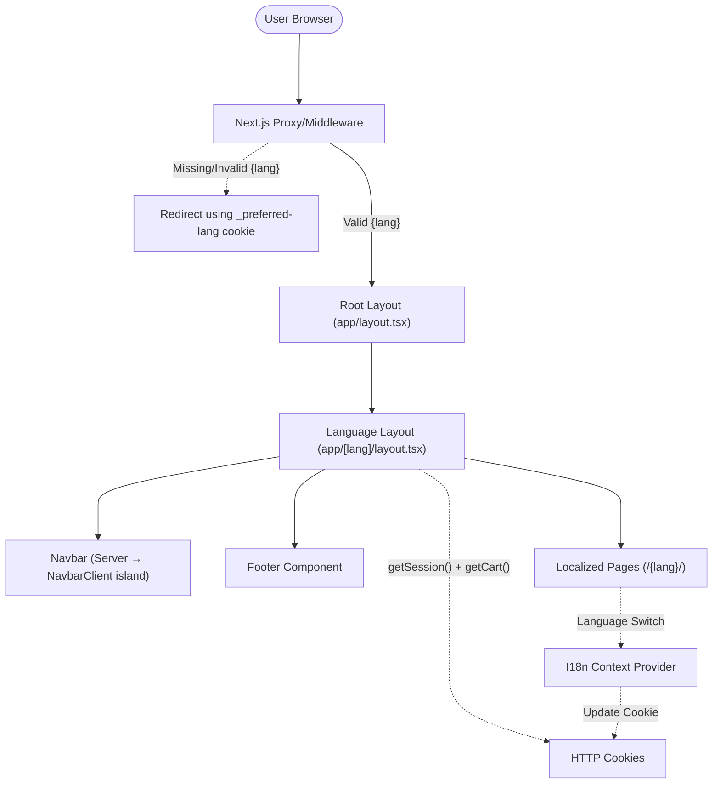
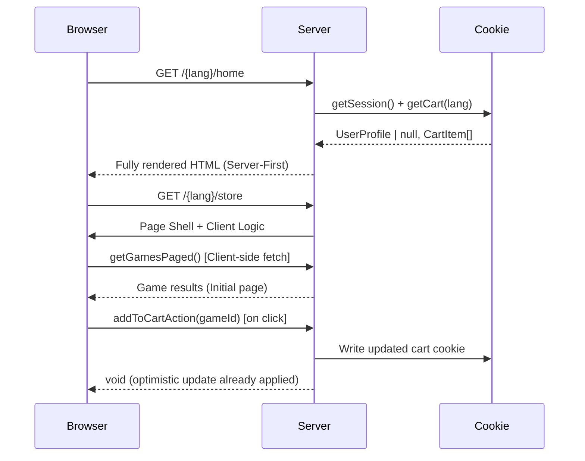
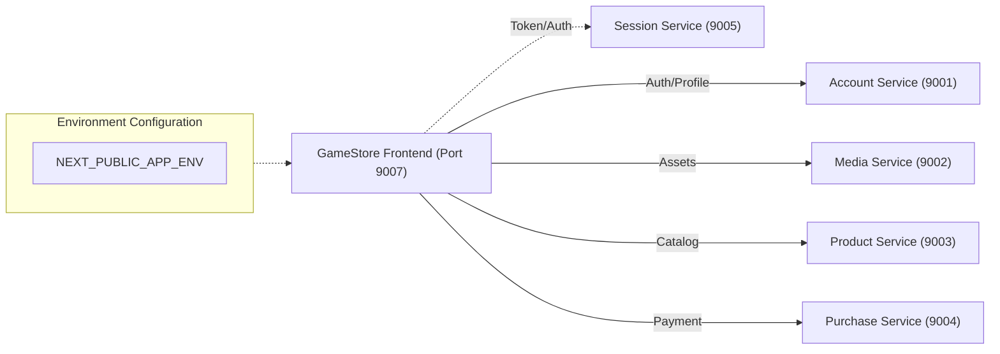

# High-Level Design (HLD) - GameStore Frontend

## System Architecture
The GameStore Frontend is a Next.js 16 application using a **hybrid rendering strategy**: core pages (Home, Game Details, Profile, Auth) are async server components, while the Store page utilizes client-side state for infinite scroll and debounced search. `'use client'` is also applied to interactive islands like cart mutations and form validation.

## Routing Architecture
All user-facing routes use a dynamic language prefix `/{lang}/`. A server-side proxy handles incoming requests to ensure a valid language context is always present.

## Request / Render Flow

## Service Integration Layer
The frontend communicates with five distinct backend services via environment-configured URLs.

## Key Components

1. **Server Proxy (`proxy.ts`):** Normalizes paths and manages the `_preferred-lang` cookie.
2. **Language Layout (`app/[lang]/layout.tsx`):** Server component — reads session and cart from cookies in parallel, initializes `AuthProvider` and `CartProvider` with server-fetched state.
3. **I18n Engine:** Dictionary-based system; server components use `getTranslations(lang)`, client components use `useI18n()`.
4. **Cart System (`lib/api/cart.ts` + `lib/hooks/useCart.tsx`):** Server actions manage cookie persistence; `CartProvider` applies mutations optimistically on the client and calls server actions in the background.
5. **Suspense Streaming (`store/games-grid.tsx`):** The game grid is an async server component wrapped in `<Suspense>` with an animated skeleton fallback, so the store page shell renders immediately.
6. **Asset Layer:** Uses `next/image` for high-performance localized asset rendering.
