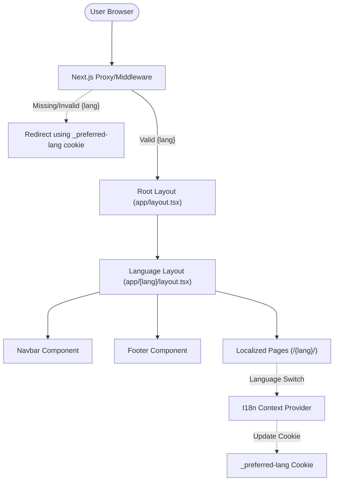
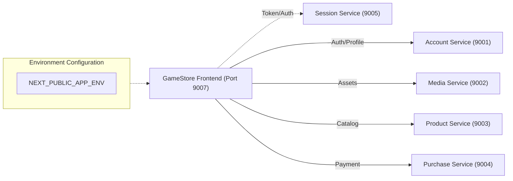

# High-Level Design (HLD) - GameStore Frontend

## System Architecture
The GameStore Frontend is a Next.js application designed with a language-first routing architecture. It utilizes a **Hybrid Rendering Strategy** (SSR for layout/SEO, CSR for interactivity) to provide a high-performance experience. See [Hybrid Architecture](HYBRID-ARCHITECTURE.md) for details.

## Routing Architecture
The application uses a dynamic language prefix `/{lang}/` for all user-facing routes. A server-side proxy handles incoming requests to ensure a valid language context is always present.

## Service Integration Layer
The frontend communicates with five distinct backend services via environment-configured URLs.

## Key Components
1.  **Server Proxy (proxy.ts):** Normalizes paths and manages the `_preferred-lang` cookie.
2.  **I18n Engine:** Dictionary-based system synchronized with URL state.
3.  **Asset Layer:** Uses `next/image` for high-performance localized asset rendering.
4.  **State Management:** Custom hooks (e.g., `useCart`) for persistent commerce logic.
